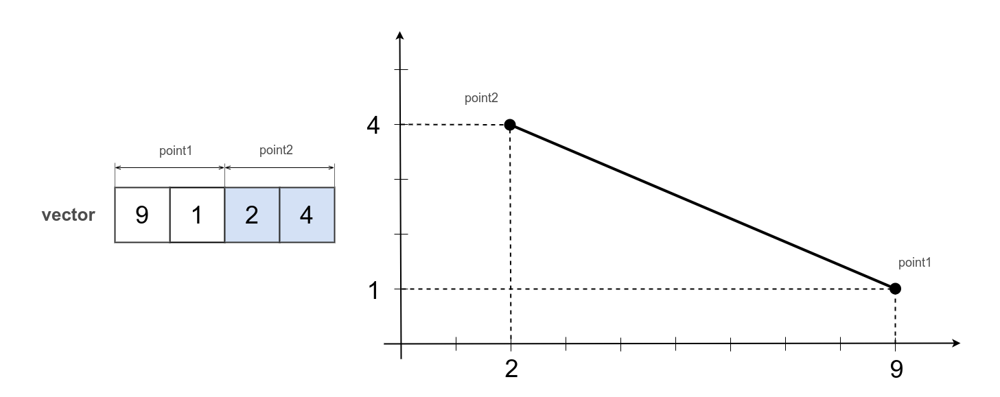
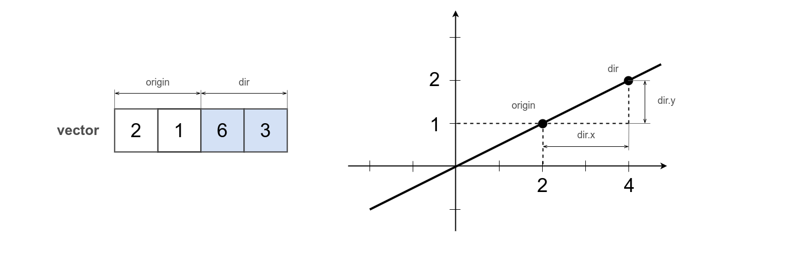
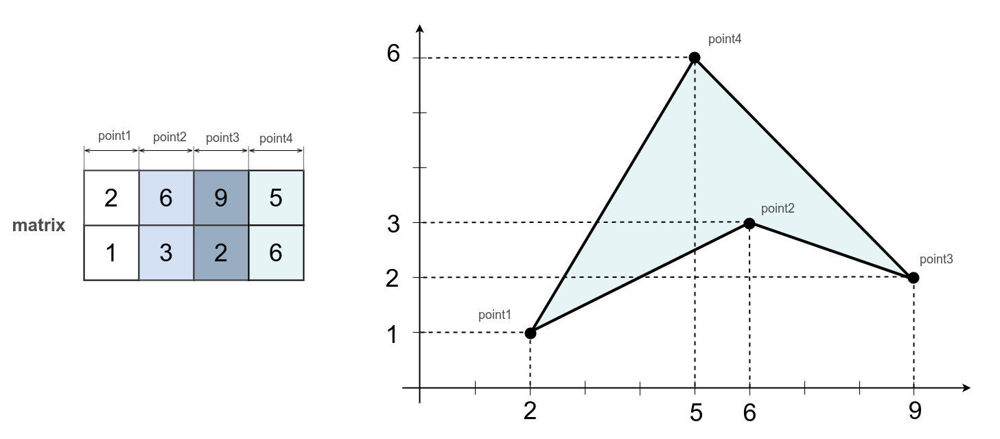
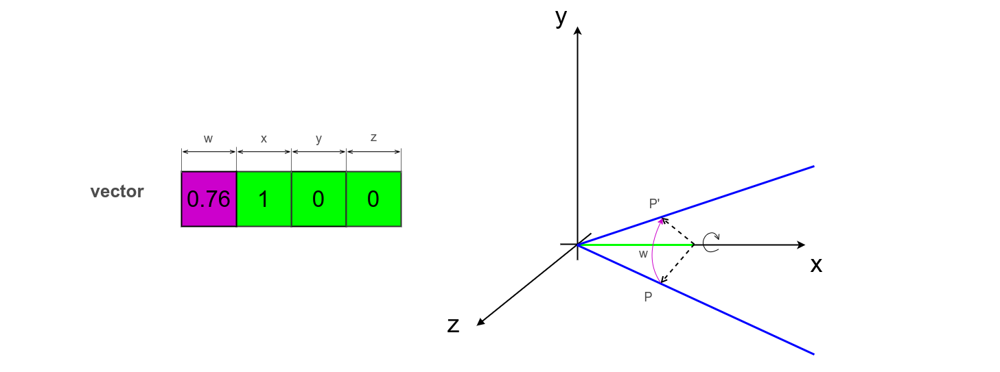

# Mathematical model

A formal description of a system using mathematical concepts and language.

### Box

The mathematical model of n-orthotope, also called a hyperrectangle or a box.

An instance of the model is stored in any vector form.

```js
var box = [ 2, 1, 9, 5 ];
var point = [ 6, 8 ];
var got = _.box.pointDistance( box, point );
console.log( `Distance from box to point : ${ _.toStr( got, { precision : 2 } ) }` );
/* log : Distance from box to point : 3.0 */
```


In a 2D, the box looks like a rectangle. The bottom left and top right points of this rectangle are used to describe this A  model. To describe a box in a 2D case, 4 scalars are enough.

### Segment

The mathematical model of the segment.

An instance of the model is stored in any vector form.

```js
var segment = [ 9, 1, 2, 4 ];
var point = [ 3, 5 ];
var distance = _.segment.pointDistance( segment, point );
console.log( `Distance from segment to point : ${ _.toStr( distance, { precision : 2 } ) }` );
/* log : Distance from segment to point : 1.3 */
```



Defined by two points: the beginning of `( 2, 1 )` and the end of the segment `( 9, 4 )`. 4 scalars are enough to describe a segment in a 2D.

### Capsule

The mathematical model of the capsule.

A capsule is a segment that has a thickness. The capsule, as well as the segment, is described by two points denoting the beginning and the end, and also has a thickness and rounding at the ends. An instance of the model is stored in any vector form.

```js
var capsule = [ 9, 1, 2, 4, 0.5 ];
var point = [ 3, 5 ];
var distance = _.capsule.pointDistance( capsule, point );
console.log( `Distance from capsule to point : ${ _.toStr( distance, { precision : 2 } ) }` );
/* log : Distance from capsule to point : 0.81 */
```


The capsule in the example starts at the point `( 2, 1 )`, ends at the point `( 9, 4 )` and has a radius of `0.5`. 5 scalars are enough to describe a capsule in a 2D.

### Sphere

The mathematical model of the hypersphere.

In a 2D it's a circle, in 3D it's a normal sphere, in 4D it's a glom. It is described by the center and radius. An instance of the model is stored in any vector form.

```js
var sphere = [ 2, 1, 3 ];
var point = [ 5, 6 ];
var distance = _.sphere.pointDistance( sphere, point );
console.log( `Distance from sphere to point : ${ _.toStr( distance, { precision : 2 } ) }` );
/* log : Distance from sphere to point : 2.8 */
```


In a 2D, the sphere turns into a circle.

The center of the circle from the example is at the point `( 2, 1 )` and its radius is `3`. 3 scalars are enough to describe a sphere in a 2D.

### Ray

The mathematical model of the ray.

The first point marks the beginning of the ray, the second sets the direction. An instance of the model is stored in any vector form.

```js
var ray = [ 2, 1, 6, 3 ];
var point = [ 2, 3 ];
var distance = _.ray.pointDistance( ray, point );
console.log( `Distance from ray to point : ${ _.toStr( distance, { precision : 2 } ) }` );
/* log : Distance from ray to point : 1.8 */
```


The ray `ray` from the example begins at the point `( 2, 1 )` and goes to infinity through the point `( 6, 3 )`. 4 scalars are enough to describe the ray in a 2D.

### LinePoints

The mathematical model of a line from two points.

Describes a line with two points through which it passes. An instance of the model is stored in any vector form.

```js
var line = [ 2, 1, 2, 1 ];
var point = [ 2, 3 ];
var distance = _.linePointDir.pointDistance( line, point );
console.log( `Distance from line by point and direction to point : ${ _.toStr( distance, { precision : 2 } ) }` );
/* log : Distance from line by point and direction to point : 1.8 */
```


The first two scalars of the `line` vector are the first point, the other two are the second point. A line is constructed through these two points. 4 scalars are enough to describe a line in a 2D.

### LinePointDir

The mathematical model of a line from a point and a relative direction.

The second point is set relative to the first. An instance of the model is stored in any vector form.

```js
var line = [ 2, 1, 2, 1 ];
var point = [ 2, 3 ];
var distance = _.linePointDir.pointDistance( line, point );
console.log( `Distance from line by point and direction to point : ${ _.toStr( distance, { precision : 2 } ) }` );
/* log : Distance from line by point and direction to point : 1.8 */
```



The first two scalars of the `line` vector are the first point, the other two describe the second point. However, in the case of the `lineDir` model, the coordinates of the second point are given relative to the coordinates of the first. A line is constructed through these two points. 4 scalars are enough to describe a line in a 2D.

### LinePointCentered

The mathematical model of a line that passes through the origin and a given point.

An instance of the model is stored in any vector form.

```js
var line = [ 4, 2 ];
var point = [ 2, 3 ];
var distance = _.linePointCentered.pointDistanceCentere ad2D( line, point );
console.log( `Distance from centered line to point : ${ _.toStr( distance, { precision : 2 } ) }` );
/* log : Distance from centered line to point : 1.8 */
```


The two scalars of the vector `line` are the point through which the line passes. The second point is always the origin. A line is constructed through these two points. To describe a line passing through the origin in a 2D, 2 scalars are enough.

### Plane ( implicit )

The mathematical model of a hyper-plane given by an implicit equation.

This mathematical model will always divide the space in which it exists into two halves. In a 2D it will be a line satisfying the equation `w + a * x + b * y = 0`, in 3D it will be a plane satisfying the equation `w + a * x + b * y + c * z = 0`. An instance of the model is stored in any vector form.

```js
var line = [ -2, -1, 2 ];
var point = [ 2, 3 ];
var distance = _.plane.pointDistance( line, point );
console.log( `Distance from straight to point : ${ _.toStr( distance, { precision : 2 } ) }` );
/* log : Distance from straight to point : 0.89 */
```


The line `line` satisfies the equation `-2 - 1 * x + 2 * y = 0` passes through the points `( -2, 0 )` and `( 0, +1 )`, i.e intersects the axis `x` in `- 2` and the axis `y` in `+ 1`. To describe a line through an implicit equation, 3 scalars are enough.

```js
var plane = [ -2, -1, 2, 0 ];
var point = [ 2, 3, -3 ];
var distance = _.plane.pointDistance( plane, point );
console.log( `Distance from 3D plane to point : ${ _.toStr( distance, { precision : 2 } ) }` );
/* log : Distance from 3D plane to point : 0.89 */
```


As in the case of a straight line, the plane `plane` satisfies the equation `-2 - 1 * x + 2 * y + 0 * z = 0` passes through the points `( -2, 0, z )` and `( 0 , +1, z )` i.e passes through all points where `x = -2` and `y = 0`, as well as through all points where `x = 0` and `y = 1`. 4 scalars are enough to describe a plane through an implicit equation.

### Triangle

The mathematical model of a triangle.

It is defined by three vertices. An instance of the model is stored in any vector form.

```js
var triangle = [ 2, 1, 9, 2, 5, 6 ];
var point = [ 3, 6 ]
var distance = _.triangle.pointDistance( triangle, point );
console.log( `Distance from triangle to point : ${ _.toStr( distance, { precision : 2 } ) }` );
/* log : Distance from triangle to point : 1.7 */
console.log( `Type of triangle : ${ _.strType( triangle ) }` );
/* log : Type of triangle : Array */
```


The vertices of the triangle `triangle` go consecutively by 2 scalars to the vertex. 6 scalars are enough to describe a triangle in a 2D.

### ConvexPolygon

The mathematical model of a convex polygon.

A convex polygon is a simple polygon ( not self-intersecting ) in which no line segment between two points on the boundary ever goes outside the polygon. In a convex polygon, all interior angles are less than or equal to 180 degrees. In this model of the polygon, it is set by enumerating its vertices counterclockwise. A matrix is used as a container for the data of the convex polygon model instance.

```js
var vertices =
[
  2,  6,  9,  5,
  1, -1,  2,  6,
]
var polygon = _.convexPolygon.make( vertices, 2 );
var point = [ 3, 6 ];
var distance = _.convexPolygon.pointDistance( polygon, point );
console.log( `Distance from convex polygon to point : ${ _.toStr( distance, { precision : 2 } ) }` );
/* log : Distance from convex polygon to point : 1.7 */
console.log( `Type of polygon : ${ _.strType( polygon ) }` );
/* log : Type of polygon : wMatrix */
```


In the matrix `polygon` in the columns are stored vertices of the polygon. The number of rows of the matrix `polygon` is equal to the dimension of the mathematical model` 2`, and the number of columns is equal to the number of vertices of the polygon `4`. The 4 vertices of the polygon are connected in series by faces and a convex polygon is formed. In the general case, the polygon can have any number of vertices in space of any dimension. 8 scalars are enough to describe a convex polygon with 4 vertices in a 2D.

<!-- xxx qqq : послідовність вершин полігона по годинникові чи проти? Dmytro : в математиці повороти і обходи робляться проти годинникової стрілки - це позитивний напрям -->

### ConcavePolygon

The mathematical model of a concave polygon.

A concave polygon in which the segments between two vertices at the boundary of the polygon can extend beyond the polygon. In a concave polygon, the internal angles can be greater than 180 degrees. A concave polygon is a more complex mathematical model than a convex one because a concave one can always be divided into a set of convex ones. In this model of the polygon, it is given by enumerating its vertices counterclockwise. A matrix is used as a container for the data of the concave polygon model instance.

```js
var vertices =
[
  2,  6,  9,  5,
  1,  3,  2,  6
]
var polygon = _.concavePolygon.make( vertices, 2 );
var point = [ 3, 6 ]
var distance = _.concavePolygon.pointDistance( polygon, point );
console.log( `Distance from concave polygon to point : ${ _.toStr( distance, { precision : 2 } ) }` );
/* log : Distance from concave polygon to point : 1.7 */
console.log( `Type of polygon : ${ _.strType( polygon ) }` );
/* log : Type of polygon : wMatrix */
```



In the matrix `polygon` in the columns are stored vertices of the polygon. The number of rows of the matrix `polygon` is equal to the dimension of the mathematical model` 2`, and the number of columns is equal to the number of vertices of the polygon `4`. The 4 vertices of the polygon are connected in series by faces and a polygon is formed. In the general case, the polygon can have any number of vertices in space of any dimension. 8 scalars are enough to describe a convex polygon with 4 vertices in a 2D.

### Frustum

The mathematical model of frustum - a truncated pyramid.

The truncated pyramid model is often used in 3D graphics for the visible part of the space visible to the prospective camera. The model is set by 6 faces. Each face is set by an implicit plane equation. The model instance stores its parameters in a 4x6 dimensional matrix. The plane equations are stored in the columns of such a matrix.

<!-- // aaa : compute from matrix of perspective projection | Dmytro : done -->
```js
var frustum = _.frustum.make();
var matrix = _.Matrix.FormPerspective( 90, [ 20, 70 ], [ 10, 50 ] );
_.frustum.fromMatrixHomogenous( frustum, matrix );
console.log( `Frustum from perspective matrix : \n${ frustum }` );
var point = [ 1, 1, 2 ];
/* log :
Matrix.F32x.4x6 ::
  -1.000 1.000  0.000  0.000  0.000  0.000
  0.000  0.000  0.286  -0.286 0.000  0.000
  -1.000 -1.000 -1.000 -1.000 0.500  -2.500
  0.000  0.000  0.000  0.000  25.000 -25.000
*/
var distance = _.frustum.pointDistance( frustum, point );
console.log( `Distance from frustum to point : ${ _.toStr( distance, { precision : 2 } ) }` );
/* log : Distance from frustum to point : 37 */
console.log( `Type of frustum : ${ _.strType( frustum ) }` );
/* log : Type of frustum : wMatrix */
```


The parameters of implicit equations of 6 faces of the truncated pyramid model are calculated from the matrix of perspective transformation. To describe the model of a truncated pyramid it requires 24 scalars.

### AxisAndAngle

Rotation of the object around the axis and the angle.

One possible way to set the rotation. An instance of the model is stored in any vector form.

```js
var axisAndAngle = [ Math.PI / 4, 1, 0, 0 ];
var euler = _.euler.fromAxisAndAngle2( null, axisAndAngle );
console.log( `AxisAndAngle to Euler : ${ _.toStr( euler, { precision : 2 } ) }` )
/* log : AxisAndAngle to Euler : [ 0.79, 0.0, -0.0, 0.0, 1.0, 2.0 ] */
```



The angle of rotation `axisAndAngle` is 45 degrees, and the axis `( 1, 0, 0 )`, which coincides with the axis `x`. 4 scalars are enough to describe the model of rotation around the axis and the angle.

### Euler

Rotation of the object by Euler's angles.

One possible way to set the rotation. It is set by three angles of rotation around 3 axes and 3 axes. The first 3 scalars of the vector, to store the model data, are the angles of rotation, and the last 3 scalars carry information around which axes to rotate. There are a total of 6 scalars in the vector. In 3D, there are 12 possible combinations of the sequence of axes:

- x-y-z
- x-z-y
- y-x-z
- y-z-x
- z-x-y
- z-y-x
- x-y-x
- x-z-x
- y-x-y
- y-z-y
- z-x-z
- z-y-z

Some combinations of values of angles of rotation (it is the first 3 scalars) are problematic. [Gimbal lock](https://en.wikipedia.org/wiki/Gimbal_lock) can occur, blocking the ability to rotate in the 3rd dimension.

```js
var euler = [ Math.PI/4, 0, 0, 0, 1, 2 ];
var quat = _.euler.toQuat( euler, null );
console.log( `Quat from Euler : ${ _.toStr( quat, { precision : 2 } ) }` );
/* log : Quat from Euler : [ 0.38, 0.0, 0.0, 0.92 ] */
```


The Euler's angles `euler` rotate the object by `45` degrees around the `x` axis, by `0` degrees around the `y` axis, and by `0` degrees around the `z` axis. Note that the first three scalars of the vector `[ Math.PI/4, 0, 0 ]` are the angles of rotation, and the last 3 `[ 0, 1, 2 ]` are information about which axes you want to make these rotations. `[ 0, 1, 2 ]` means `x-y-z`. 6 scalars are required to describe the Euler rotation model.

### Quat

Rotation of an object using a quaternion.

One possible way to set the rotation. Quaternion is an extension of the concept of complex numbers in 3D space. Set by 4 numbers in which the axis of rotation is coded. The length of a valid quaternion is always 1. Unlike Euler angles, the quaternion does not suffer from the problem [Gimbal lock](https://en.wikipedia.org/wiki/Gimbal_lock).

```js
var quat = [ 0.38, 0.0, 0.0, 0.92 ];
var euler = _.quat.toEuler( quat, null );
console.log( `Quat from Euler : ${ _.toStr( euler, { precision : 2 } ) }` );
/* log : Euler from Quat : [ 0.78, 0.0, -0.0, 0.0, 1.0, 2.0 ] */
```


Quaternion `quat` rotates the object by `45` degrees around the axis `x`. 4 scalars are enough to describe the quaternion model.
