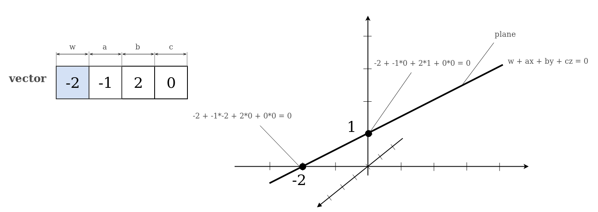
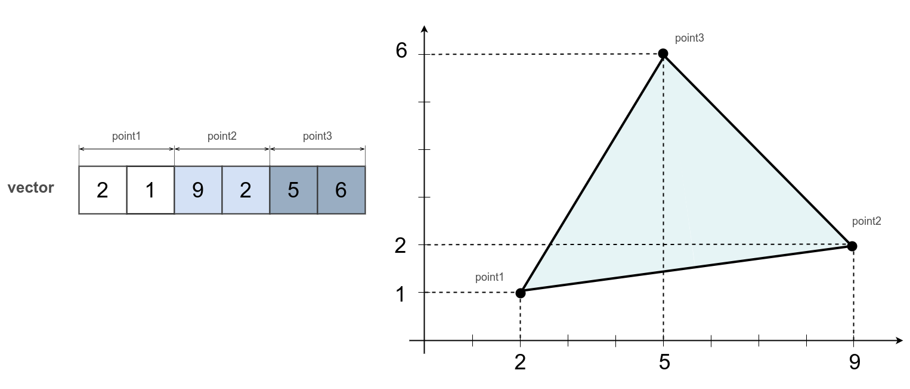

# Математична модель

Формальний опис системи за допомогою математичних концепцій та мови.
<!-- Formal description of a system using mathematical concepts and language. -->

### Box

Математична модель паралелепіпеда. Має вигляд вектора, котрий позначає головну діагональ.

```js
var box = [ 2, 1, 9, 5 ];
var point = [ 6, 8 ];
var got = _.box.pointDistance( box, point );
console.log( `Distance from box to point : ${ _.toStr( got, { precision : 2 } ) }` );
/* log : Distance from box to point : 3.0 */
```


При використанні двомірних координат паралелепіпед вироджується до прямокутника. На рисунку зображено прямокутник утворений двома точками `lbPoint` ( 2; 1 ) i `rtPoint` ( 9; 5 ), що відповідно позначають ліву нижню і праву верхню точки прямокутника.

### Segment

Математична модель відрізка. Має вигляд вектора з координатами двох точок.

```js
var segment = [ 2, 1, 9, 4 ];
var point = [ 3, 5 ];
var distance = _.segment.pointDistance( segment, point );
console.log( `Distance from segment to point : ${ _.toStr( distance, { precision : 2 } ) }` );
/* log : Distance from segment to point : 3.3 */
```


Приведений відрізок має координати `point1` ( 2; 1 ) і `point2` ( 9; 4 ). Якщо додати третю коодинату, сегмент буде побудовано в просторових координатах.

### Capsule

Математична модель відрізка, котрий має товщину.

```js
var capsule = [ 2, 1, 9, 4, 0.5 ];
var point = [ 3, 5 ];
var distance = _.capsule.pointDistance( capsule, point );
console.log( `Distance from capsule to point : ${ _.toStr( distance, { precision : 2 } ) }` );
/* log : Distance from capsule to point : 2.8 */
```


Капсула як і сегмент має дві точки що позначають початок і кінець, а також має товщину та заокруглення з радіусом рівному половині товщини. Приведений рисунок показує капсулу, що має радіус `radius` рівним `0.5`. Відстань від точки `point` ( 3; 5 ) до капсули менше на `0.5` в порівнянні зі звичайним сегментом.

### Sphere

Математична модель сфери. Має вигляд вектора з координатами центра сфери і радіуса.

```js
var sphere = [ 2, 1, 3 ];
var point = [ 5, 6 ];
var distance = _.sphere.pointDistance( sphere, point );
console.log( `Distance from sphere to point : ${ _.toStr( distance, { precision : 2 } ) }` );
/* log : Distance from sphere to point : 2.8 */
```


При використанні двомірних координат сфера вироджується до круга. На рисунку зображено круг з центром `center` ( 2; 1 ) та радіусом `radius` рівним `3`.

### Ray

Математична модель променя. Перша точка позначає початок променя, друга - задає напрям.

```js
var ray = [ 2, 1, 6, 3 ];
var point = [ 2, 3 ];
var distance = _.ray.pointDistance( ray, point );
console.log( `Distance from ray to point : ${ _.toStr( distance, { precision : 2 } ) }` );
/* log : Distance from ray to point : 1.8 */
```


Промінь зображений на рисунку має координати точок `point1` ( 2; 1 ) і `point2` ( 6; 3 ). Перша точка позначає його початок, а друга дозволяє побудувати напрям променя.

### LinePointDir

Математична модель лінії. Перша точка позначає початкові координати, а друга - зміщення відносно першої.

```js
var line = [ 2, 1, 2, 1 ];
var point = [ 2, 3 ];
var distance = _.linePointDir.pointDistance( line, point );
console.log( `Distance from line by point and direction to point : ${ _.toStr( distance, { precision : 2 } ) }` );
/* log : Distance from line by point and direction to point : 1.8 */
```


Відмінність лінії від променя в тому, що лінія не обмежена і може безкінечно продовжуватись в обох напрямах.
Лінія побудована з допомогою `linePointDir` використовує першу точку `origin` ( 2; 1 ), як точку відліку, координати наступної точки `dirPoint` ( 4; 2 ) вираховуються шляхом складання відповідних координат в векторі.

### LinePoints

Математична модель лінії. Має вигляд вектора, що містить координати двох точок.

```js
var ray = [ 2, 1, 4, 2 ];
var factor = 0.25;
var pair = _.linePoints.pairAt( ray,factor );
console.log( `Pair at factor 0.25 : ${ pair }` );
/* log : Pair at factor 0.25 : 2.500 1.250 */
```


Для побудови лінії за двома точками використовується неймспейс `linePoints`. На рисунку зображено лінію що проходить через точки `point1` ( 2; 1 ) і `point2` ( 4; 2 ).

### LinePointCentered

Математична модель лінії, котра проходить через початок координат і задану точку в просторі.

```js
var line = [ 4, 2 ];
var point = [ 2, 3 ];
var distance = _.linePointCentered.pointDistanceCentered2D( line, point );
console.log( `Distance from centered line to point : ${ _.toStr( distance, { precision : 2 } ) }` );
/* log : Distance from centered line to point : 1.8 */
```


Для побудови лінії котра проходить через початок координат простіше викоритовувати рутини неймспейса `linePointCentered`. На рисунку лінія задана лише координатою однієї точки `point` ( 4; 2 ).

### Plane ( implicit )

Математична модель площини. Має вигляд вектора, котрий містить коефіцієнти для неявного рівняння площини.

```js
var line = [ -2, -1, 2 ];
var point = [ 2, 3 ];
var distance = _.plane.pointDistance( line, point );
console.log( `Distance from straight to point : ${ _.toStr( distance, { precision : 2 } ) }` );
/* log : Distance from straight to point : 0.89 */
```


При використанні лише трьох координат рутини оперують лінією заданою через коєфіцієнти рівняння. Перше число `w` `-2` - константа, а інші вираховуються щоб забезпечити рівність. На зображеній лінії коефіцієнт `a` має значення `1`, а `b` - `2`.

```js
var plane = [ -2, -1, 2, 0 ];
var point = [ 2, 3, -3 ];
var distance = _.plane.pointDistance( plane, point );
console.log( `Distance from 3D plane to point : ${ _.toStr( distance, { precision : 2 } ) }` );
/* log : Distance from 3D plane to point : 0.89 */
```



Якщо одна із чотирьох координат рівна нулю, рутини оперують математичною моделлю площини. Відповідно зображена площина паралельна осі `z` і з приведеного ракурсу вироджується в лінію як на рисунку з лінією.

### Triangle

Математична модель трикутника. Має вигляд вектора координат трьох вершин.

```js
var triangle = [ 2, 1, 9, 2, 5, 6 ];
var point = [ 2, 5 ]
var distance = _.triangle.pointDistance( triangle, point );
console.log( `Distance from triangle to point : ${ _.toStr( distance, { precision : 2 } ) } )` );
/* log : Distance from triangle to point : 1.1 */
console.log( `Type of triangle : ${ _.strType( triangle ) }` );
/* log : Type of triangle : VectorAdapterFromLong */
```



На рисунку зображено трикутник з точками `point1` ( 2; 1 ), `point2` ( 9; 2 ) i `point3` ( 5; 6 ).

### ConvexPolygon

Математична модель опулого полігону. Має вигляд матриці координат вершин полігона.

```js
var vertices =
[
  2,  6,  9,  5,
  1, -1,  2,  6
]
var polygon = _.convexPolygon.make( vertices, 2 );
var point = [ 3, 6 ];
var distance = _.convexPolygon.pointDistance( polygon, point );
console.log( `Distance from convex polygon to point : ${ _.toStr( distance, { precision : 2 } ) }` );
/* log : Distance from convex polygon to point : 1.7 */
console.log( `Type of polygon : ${ _.strType( polygon ) }` );
/* log : Type of polygon : wMatrix */
```


Зображений полігон є випуклим бо жоден з кутів утворених вершинами `point1` ( 2; 1 ), `point2` ( 6; -1 ), `point3` ( 9, 2 ) і `point4` ( 5; 6 ) не більше ніж 180 градусів.

### ConcavePolygon

Математична модель впуклого полігону. Має вигляд матриці координат вершин полігона.

```js
var vertices =
[
  2,  6,  9,  5,
  1,  3,  2,  6
]
var polygon = _.concavePolygon.make( vertices, 2 );
var point = [ 3, 6 ]
var distance = _.concavePolygon.pointDistance( polygon, point );
console.log( `Distance from concave polygon to point : ${ _.toStr( distance, { precision : 2 } ) }` );
/* log : Distance from concave polygon to point : 1.7 */
console.log( `Type of polygon : ${ _.strType( polygon ) }` );
/* log : Type of polygon : wMatrix */
```


Зображений полігон є впуклим бо кут утворений вершинами `point1` ( 2; 1 ), `point2` ( 6; 3 ), `point3` ( 9, 2 ) більше ніж 180 градусів. Будь-який впуклий полігон може бути розділений на декілька опуклих. Так, приведений полігон може бути розділений на 2 трикутни полігона за віссю `point2` i `point4`.

### Frustum

Математична модель фрустума. Має вигляд матриці площин.

```js
var frustum = _.frustum.make().copy
([
  0,   0,   0,   0,  -1,   1,
  1,  -1,   0,   0,   0,   0,
  0,   0,   1,  -1,   0,   0,
 -1,   0,  -1,   0,   0,  -1
]);
var point = [ 1, 1, 2 ]
var distance = _.frustum.pointDistance( frustum, point );
console.log( `Distance from frustum to point : ${ _.toStr( distance, { precision : 2 } ) }` );
/* log : Distance from frustum to point : 1.0 */
console.log( `Type of frustum : ${ _.strType( frustum ) }` );
/* log : Type of frustum : wMatrix */
```


Приведене зображення фрустума показує, що для утворення фігури необхідно задати шість площин. Зі збільшенням відстані від точки спостереження збільшується площа перетину утвореної фігури.

### AxisAndAngle

Задає поворот об'єкта за заданою віссю обертання і кутом повороту.

```js
var axisAndAngle = [ 1, 0, 0, Math.PI / 4 ];
var euler = _.euler.fromAxisAndAngle2( null, axisAndAngle );
console.log( `AxisAndAngle to Euler : ${ _.toStr( euler, { precision : 2 } ) }` )
/* log : AxisAndAngle to Euler : [ 0.79, 0.0, -0.0, 0.0, 1.0, 2.0 ] */
```


При використанні повороту за віссю і кутом в переданому векторі позначається вісь відносно якої відбудеться поворот і кут. Відповідно, заданий вектор зображає поворот відносно осі `x` на 45 градусів.

### Euler

Задає поворот об'єкта за вектором утвореним кутами повороту і порядком здійснення поворотів.

```js
var euler = [ Math.PI/4, 0, 0, 0, 1, 2 ];
var quat = _.euler.toQuat( euler, null );
console.log( `Quat from Euler : ${ _.toStr( quat, { precision : 2 } ) }` );
/* log : Quat from Euler : [ 0.38, 0.0, 0.0, 0.92 ] */
```


Для повороту з допомогою кутів ейлера необхідно позначити кути поворотів відносно осей `x`, `y` i `z` та порядок цих поворотів. Вектор `[ Math.PI/4, 0, 0, 0, 1, 2 ]` показує що здійснюється поворот лише за віссю `x` на 45 градусів.

### Quat

Задає поворот об'єкта використовуючи кватерніони.

```js
var quat = [ 0.38, 0.0, 0.0, 0.92 ]
var euler = _.quat.toEuler( quat, null )
console.log( `Quat from Euler : ${ _.toStr( euler, { precision : 2 } ) }` )
/* log : Euler from Quat : [ 0.78, 0.0, -0.0, 0.0, 1.0, 2.0 ] */
```


Для повороту з допомогою кватерніона в векторі спочатку передається дійсна частина кватерніона, що визначає поворот, а наступними елементами задається вісь повороту. На приведеному рисунку здійснюється поворот відносно осі `x` на 45 градусів.
