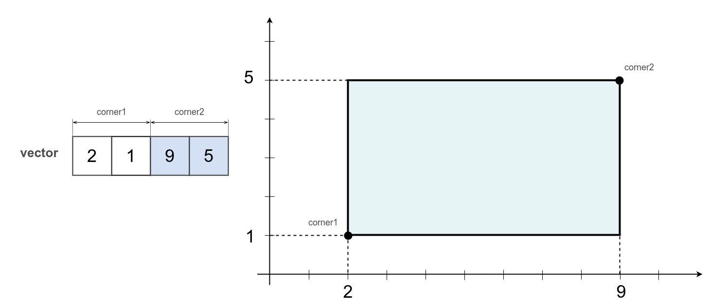
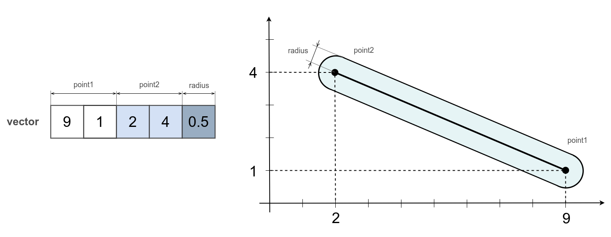
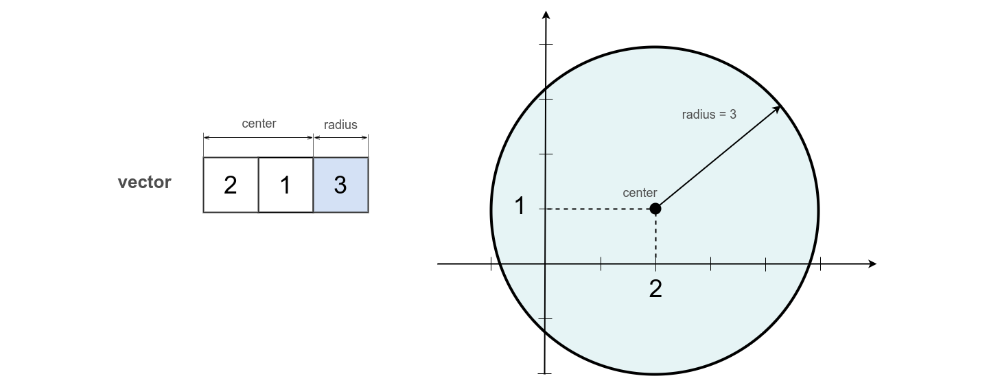
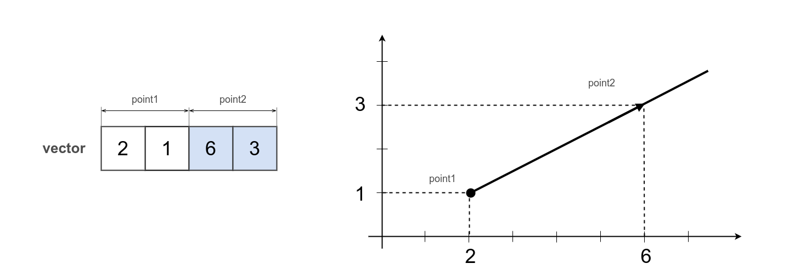
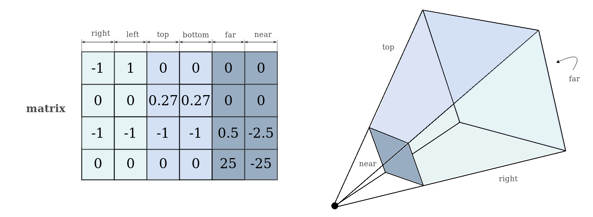
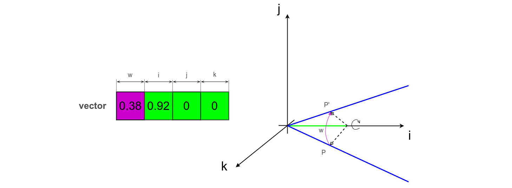

# Математична модель

Формальний опис системи за допомогою математичних концепцій та мови.
<!-- Formal description of a system using mathematical concepts and language. -->

### Box

Математична модель n-ортотопа, або інакше гіпер-прямокутинака або бокса. <!-- Mathematical model of n-orthotope, also called a hyperrectangle or a box. --> Екземпляр моделі зберігається в будь-якій формі вектора.

```js
var box = [ 2, 1, 9, 5 ];
var point = [ 6, 8 ];
var got = _.box.pointDistance( box, point );
console.log( `Distance from box to point : ${ _.toStr( got, { precision : 2 } ) }` );
/* log : Distance from box to point : 3.0 */
```



В 2D бокс має вигляд прямокутника. Ліва нижня і права верхня точки цього прямокутника використовуються для опису цієї математичної моделі. Для опису бокса в 2D випадку достатньо 4-х скялярів.

### Segment

Математична модель відрізка. Екземпляр моделі зберігається в будь-якій формі вектора.

```js
var segment = [ 2, 1, 9, 4 ];
var point = [ 3, 5 ];
var distance = _.segment.pointDistance( segment, point );
console.log( `Distance from segment to point : ${ _.toStr( distance, { precision : 2 } ) }` );
/* log : Distance from segment to point : 3.3 */
```


Задається двома точками: початком `( 2, 1 )` та кінцем відрізка `( 9, 4 )`. Для опису відрізка в 2D достатньо 4 скалярів.

### Capsule

Математична модель капсули. Касула це відрізок, котрий має товщину. Капсула як і сегмент описується двома точки що позначають початок і кінець, а також має товщину та заокруглення на кінцях. Екземпляр моделі зберігається в будь-якій формі вектора.

```js
var capsule = [ 2, 1, 9, 4, 0.5 ];
var point = [ 3, 5 ];
var distance = _.capsule.pointDistance( capsule, point );
console.log( `Distance from capsule to point : ${ _.toStr( distance, { precision : 2 } ) }` );
/* log : Distance from capsule to point : 2.8 */
```



Капсула в прикладі починається в точці `( 2, 1 )`, закінчується в точці `( 9, 4 )` і має радіус `0.5`. Для опису капсули в 2D достатньо 5 скалярів.

### Sphere

Математична модель гіпер-сфери. В 2D це коло, в 3D це звичайна сфера, в 4D це глом. Описується центром та радіусом. Екземпляр моделі зберігається в будь-якій формі вектора.

```js
var sphere = [ 2, 1, 3 ];
var point = [ 5, 6 ];
var distance = _.sphere.pointDistance( sphere, point );
console.log( `Distance from sphere to point : ${ _.toStr( distance, { precision : 2 } ) }` );
/* log : Distance from sphere to point : 2.8 */
```



В 2D сфера перетворюється в коло. Центр кола з прикладу в точці `( 2, 1 )` а його радіус `3`. Для опису сфери в 2D достатньо 3-х скалярів.

### Ray

Математична модель променя. Перша точка позначає початок променя, друга - задає напрям. Екземпляр моделі зберігається в будь-якій формі вектора.

```js
var ray = [ 2, 1, 6, 3 ];
var point = [ 2, 3 ];
var distance = _.ray.pointDistance( ray, point );
console.log( `Distance from ray to point : ${ _.toStr( distance, { precision : 2 } ) }` );
/* log : Distance from ray to point : 1.8 */
```



Промінь `ray` з прикладу починається в точці `( 2, 1 )` та прямує в безкінечність через точку `( 6, 3 )`. Для опису проеменя в 2D достатньо 4-х скалярів.

### LinePoints

Математична модель прямої за двома точками. Описує пряму двома точками, через які вона проходить. Екземпляр моделі зберігається в будь-якій формі вектора.

```js
var line = [ 2, 1, 4, 2 ];
var factor = 0.25;
var pair = _.linePoints.pairAt( line, factor );
console.log( `Pair at factor 0.25 : ${ pair }` );
/* log : Pair at factor 0.25 : 2.500 1.250 */
```


Перші два скаляри вектора `line` є першою точкою, інші два другою точкою. За цими двома точками будується пряма. Для опису прямої в 2D достатньо 4-х скалярів.

### LinePointDir

Математична модель прямої за точкою та відносним напрямком. Друга точка задається відносної першої. Екземпляр моделі зберігається в будь-якій формі вектора.

```js
var line = [ 2, 1, 2, 1 ];
var point = [ 2, 3 ];
var distance = _.linePointDir.pointDistance( line, point );
console.log( `Distance from line by point and direction to point : ${ _.toStr( distance, { precision : 2 } ) }` );
/* log : Distance from line by point and direction to point : 1.8 */
```


Перші два скаляри вектора `line` є першою точкою, інші два описують другу точку. Проте в випадку моделі `lineDir` координати другої точки задані відносно координат першої. За цими двома точками будується пряма. Для опису прямої в 2D достатньо 4-х скалярів.

### LinePointCentered

Математична модель прямої, котра проходить через початок координат і задану точку. Екземпляр моделі зберігається в будь-якій формі вектора.

```js
var line = [ 4, 2 ];
var point = [ 2, 3 ];
var distance = _.linePointCentered.pointDistanceCentered2D( line, point );
console.log( `Distance from centered line to point : ${ _.toStr( distance, { precision : 2 } ) }` );
/* log : Distance from centered line to point : 1.8 */
```


Два скаляри вектора `line` є точкою через яку проходить пряма. Друга точка завжди початок координат. За цими двома точками будується пряма. Для опису прямої яка проходить через початок координат в 2D достатньо 2-х скалярів.

### Plane ( implicit )

Математична модель гіпер-площини заданої неявним рівнянням. Ця математична модель завжди ділитиме простір в якому вона існує на дві половини. В 2D це буде пряма, що задовольняє рівняння `w + a*x + b*y = 0`, в 3D це буде площина, що задовльняє рівняння `w + a*x + b*y + c*z = 0`. Екземпляр моделі зберігається в будь-якій формі вектора.

```js
var line = [ -2, -1, 2 ];
var point = [ 2, 3 ];
var distance = _.plane.pointDistance( line, point );
console.log( `Distance from straight to point : ${ _.toStr( distance, { precision : 2 } ) }` );
/* log : Distance from straight to point : 0.89 */
```


Пряма `line` задовольняє рівняння `-2 - 1*x + 2*y = 0` проходить через точки `( -2, 0 )` та `( 0, +1 )`, тобто перетинає вісь `x` в `-2` та вісь `y` в `+1`. Для опису прямої через неявне рівнняння достатньо 3-х скалярів.

```js
var plane = [ -2, -1, 2, 0 ];
var point = [ 2, 3, -3 ];
var distance = _.plane.pointDistance( plane, point );
console.log( `Distance from 3D plane to point : ${ _.toStr( distance, { precision : 2 } ) }` );
/* log : Distance from 3D plane to point : 0.89 */
```


Так само, як у випадку із прямої, пощина `plane` задовольняє рівняння `-2 - 1*x + 2*y + 0*z = 0` проходить через точки `( -2, 0, z )` та `( 0, +1, z )` тобто проходить через всі точки де `x = -2` та `y = 0`, а також через всі точки, де `x = 0` та `y = 1`. Для опису площини через неявне рівнняння достатньо 4-х скалярів.

### Triangle

Математична модель трикутника. Задається трьома вершинами. Екземпляр моделі зберігається в будь-якій формі вектора.

```js
var triangle = [ 2, 1, 9, 2, 5, 6 ];
var point = [ 3, 6 ]
var distance = _.triangle.pointDistance( triangle, point );
console.log( `Distance from triangle to point : ${ _.toStr( distance, { precision : 2 } ) }` );
/* log : Distance from triangle to point : 1.7 */
console.log( `Type of triangle : ${ _.strType( triangle ) }` );
/* log : Type of triangle : Array */
```


Вершини трикутника `triangle` йдуть послідовно по 2-ва скаляри на вершину. Для опису трикутника в 2D достатньо 6-и скалярів.

### ConvexPolygon

Математична модель випуклого полігона. Випуклий полігон це простий полігон ( не перетинає сам себе ) в котрому жоден відрізок між двома вершинами на межі полігона не виходить за межі полігона. В випуклому полігоні всі внутрішні кути є меншими чи рівними 180 градусів. В цій моделі полігона він задається його вершинами. В якості контейнера для даних екземпляра моделі випуклого полігона використовується матриця.
<!-- Convex polygon is a simple polygon ( not self-intersecting ) in which no line segment between two points on the boundary ever goes outside the polygon. In a convex polygon, all interior angles are less than or equal to 180 degrees. -->

```js
var vertices =
[
  2,  6,  9,  5,
  1, -1,  2,  6,
]
var polygon = _.convexPolygon.make( vertices, 2 );
var point = [ 3, 6 ];
var distance = _.convexPolygon.pointDistance( polygon, point );
console.log( `Distance from convex polygon to point : ${ _.toStr( distance, { precision : 2 } ) }` );
/* log : Distance from convex polygon to point : 1.7 */
console.log( `Type of polygon : ${ _.strType( polygon ) }` );
/* log : Type of polygon : wMatrix */
```


В матриці `polygon` в колонках зберігаються вершини полігона. Кількість рядків матриці `polygon` рівна розміності математичної моделі `2`, а кількість колонок рівна кількості вершин полігона `4`. 4-ри вершини полігона поєднуються послідовно гранями і утворюється випуклий полігон. В загальному випадку полігон може мати будь-яку кількість вершин, в просторі будь-якої розмірності. Для опису випуклого полігона із 4-ма вершинами в 2D достатньо 8-и скалярів.

<!-- xxx qqq : послідовність вершин полігона по годинникові чи проти? Dmytro : в математиці повороти і обходи робляться проти годинникової стрілки - це позитивний напрям -->

### ConcavePolygon

Математична модель впуклого полігона. Впуклий полігон в котрому відрізки між двома вершинами на межі полігона можуть виходить за межі полігона. У впуклому полігоні внутрішні кути можуть бути більшими 180 градусів. Впуклий полігон більш складна математична модель за випуклий адже впуклий завжди можливо розбити на сукупність випуклих. В цій моделі полігона він задається його вершинами. В якості контейнера для даних екземпляра моделі випуклого полігона використовується матриця.

```js
var vertices =
[
  2,  6,  9,  5,
  1,  3,  2,  6
]
var polygon = _.concavePolygon.make( vertices, 2 );
var point = [ 3, 6 ]
var distance = _.concavePolygon.pointDistance( polygon, point );
console.log( `Distance from concave polygon to point : ${ _.toStr( distance, { precision : 2 } ) }` );
/* log : Distance from concave polygon to point : 1.7 */
console.log( `Type of polygon : ${ _.strType( polygon ) }` );
/* log : Type of polygon : wMatrix */
```


В матриці `polygon` в колонках зберігаються вершини полігона. Кількість рядків матриці `polygon` рівна розміності математичної моделі `2`, а кількість колонок рівна кількості вершин полігона `4`. 4-ри вершини полігона поєднуються послідовно гранями і утворюється полігон. В загальному випадку полігон може мати будь-яку кількість вершин, в просторі будь-якої розмірності. Для опису впуклого полігона із 4-ма вершинами в 2D достатньо 8-и скалярів.

### Frustum

Математична модель фрустума - обрізаної піраміди. Модель обрізаної піраміди часто застосовується в 3D графіці для видимої частини простору видимої перспективною камерою. Модель задається 6-мома гранями <!-- faces  -->. Кожна грань, в свою чергу, задана неявним рівнянням площини. Екземпляр моделі зберігає свої параметри в матриці розмірності 4x6. Рівняння площини зберігаються в колонках такої матриці.

```js
var frustum = _.frustum.make();
// qqq : compute from matrix of perspective projection
var point = [ 1, 1, 2 ]
var distance = _.frustum.pointDistance( frustum, point );
console.log( `Distance from frustum to point : ${ _.toStr( distance, { precision : 2 } ) }` );
/* log : Distance from frustum to point : 1.0 */
console.log( `Type of frustum : ${ _.strType( frustum ) }` );
/* log : Type of frustum : wMatrix */
```



Параметри неявних рівнянь 6-ти граней моделі обрізаної піраміди вираховуються із матриці перспективної трансофрмації. Для опису моделі обрізаної піраміти потрібно 24-ри скаляри.

### AxisAndAngle

Обертання об'єкта за віссю обертання і кутом повороту. Один із можливих способів задати обертання. Екземпляр моделі зберігається в будь-якій формі вектора.

```js
var axisAndAngle = [ Math.PI / 4, 1, 0, 0 ];
var euler = _.euler.fromAxisAndAngle2( null, axisAndAngle );
console.log( `AxisAndAngle to Euler : ${ _.toStr( euler, { precision : 2 } ) }` )
/* log : AxisAndAngle to Euler : [ 0.79, 0.0, -0.0, 0.0, 1.0, 2.0 ] */
```


Кутом обертання `axisAndAngle` є 45 градусів, а вісь `( 1, 0, 0 )`, що співпадає із вісюю `x`. Для опису моделі обертання за віссю і кутом обертання достатньо 4-х скалярів.

### Euler

Обертання об'єкта за кутами еулера. Один із можливих способів задати обертання. Задається трьому кутами поворота навколо 3-х осей та 3-ма осями. Перших 3-ри скаляри вектора, для зберігання даних моделі є кутами поврота, а останні 3-ри скаляри несуть інформацію про те навколо яких осей потрібно здійснювать поворот. Всього в векторі 6-ть скалярів. В 3D існує 12 можливих комбінацій послідовності осей:

- x-y-z
- x-z-y
- y-x-z
- y-z-x
- z-x-y
- z-y-x
- x-y-x
- x-z-x
- y-x-y
- y-z-y
- z-x-z
- z-y-z

Деякі комбіанції значень кутів поворота ( йдетьяс про перших 3-ри скаляри ) є проблемними. [Гімбал лок](https://en.wikipedia.org/wiki/Gimbal_lock) може виникати заблокувавши можливість обертання в 3-ій розмірності.

```js
var euler = [ Math.PI/4, 0, 0, 0, 1, 2 ];
var quat = _.euler.toQuat( euler, null );
console.log( `Quat from Euler : ${ _.toStr( quat, { precision : 2 } ) }` );
/* log : Quat from Euler : [ 0.38, 0.0, 0.0, 0.92 ] */
```


Кути еулера `euler` розвертають об'єкт на `45` градусів навколо осі `x`, на `0` градусів навколо осі `y`, та на `0` градусів навколо осі `z`. Зверніть увагу, що перші три скаляри вектора `[ Math.PI/4, 0, 0 ]` є кутами поворота, а останні 3 `[ 0, 1, 2 ]` є інформацією про те навколо котрий осей потрібно здійснювати ці повороти. `[ 0, 1, 2 ]` означає `x-y-z`. Для опису моделі обертання за кутами еулера потрібно 6-ть скалярів.

### Quat

Обертання об'єкта за допомогою кватерніона. Один із можливих способів задати обертання. Кватерніон це розширення концепції комплексних чисел в 3D простір. Задається 4-ма числами в яких закодована вісь обертання на поворот. Довжина валідного кватерніона завжди 1. На відміну від кутів еулера, кватерніон не страждає від проблеми [гімбал лока](https://en.wikipedia.org/wiki/Gimbal_lock).

```js
var quat = [ 0.38, 0.0, 0.0, 0.92 ]
var euler = _.quat.toEuler( quat, null )
console.log( `Quat from Euler : ${ _.toStr( euler, { precision : 2 } ) }` )
/* log : Euler from Quat : [ 0.78, 0.0, -0.0, 0.0, 1.0, 2.0 ] */
```



Кватерніон `quat` розвертає об'єкт на `45` градусів навколо осі `x`. Для опису моделі кватерніон достатньо 4-х скалярів.
